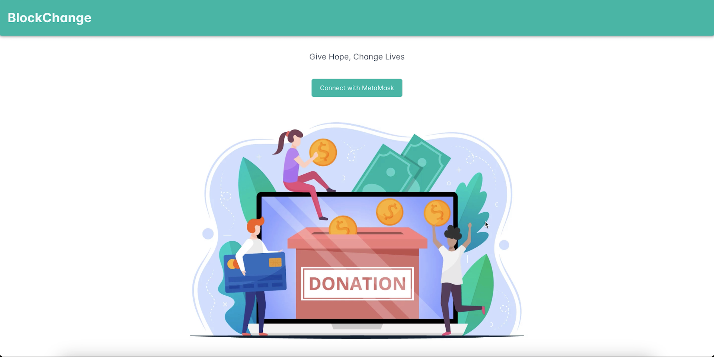

# Welcome to BlockChange!

A Proof-of-Concept (PoC) DApp designed to demonstrate the innovative integration of Ethereum and decentralized technologies within the realm of charity and crowdfunding.

This project was built using Vue.js, Web3.js, IPFS, and Solidity; and requires Ganache and Truffle framework to run in a development environment. It will also require the MetaMask extension to simulate login.

Additionally, this project uses Pinata to simplify and streamline IPFS integration. You will need to create a free Pinata account and set the environment variables detailed below.

Setting up - 

1. Ensure Node.js is installed
2. Clone the repository
3. Install truffle 
````
npm install -g truffle
````

4. In the project directory, install all project dependencies
```
npm install
```
5. Install [Ganache](https://trufflesuite.com/ganache/)
6. Install [MetaMask](https://metamask.io/download/) for your web browser and create a wallet
7. [Connect MetaMask to Ganache testnet and import accounts](https://coinsbench.com/connect-to-metamask-from-new-or-existing-web-application-with-truffle-and-ganache-f48aa763c0ac) Note: do not import the first Ganache account as that is allotted to the smart contract.
8. Create [Pinata Cloud account](https://app.pinata.cloud/register)
9. Set environment variables to connect to Pinata
```
VITE_PINATA_JWT=<jwt_for_your_account>
VITE_PUBLIC_GATEWAY_URL=<public_gateway_of_your_account>
VITE_PUBLIC_GATEWAY_TOKEN=<gateway_api_token>
```
10. Run the application
```
npm run dev
```

11. Search `https://localhost:5173` in your browser (where MetaMask is installed), and you should see the landing page of the app!
